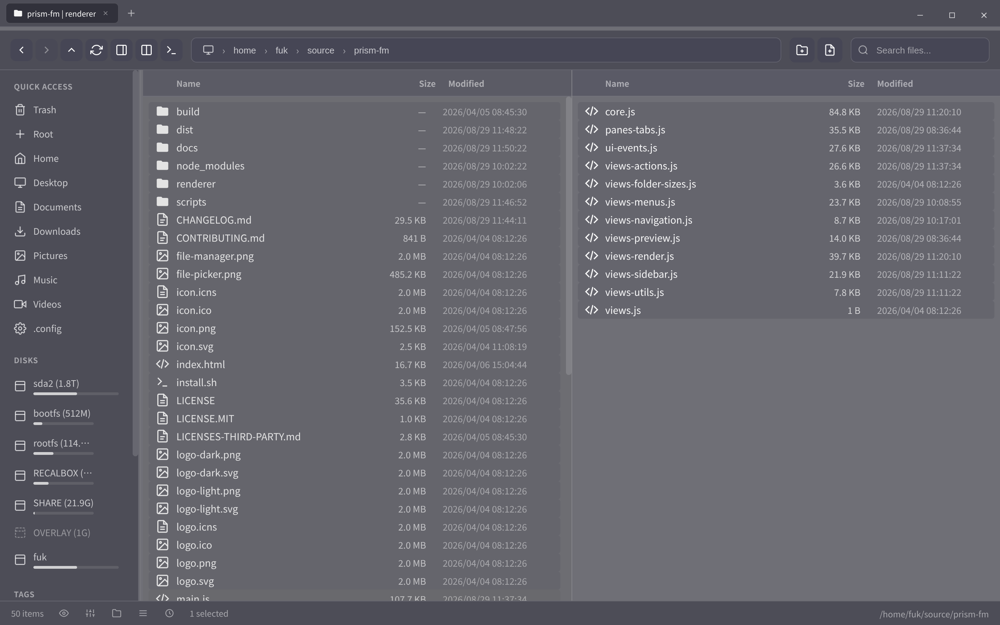
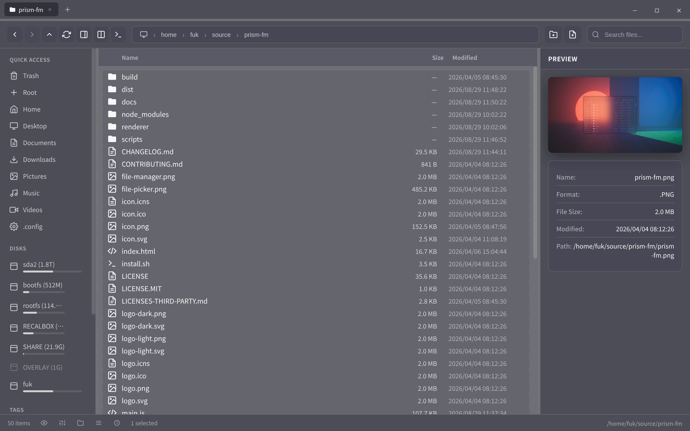
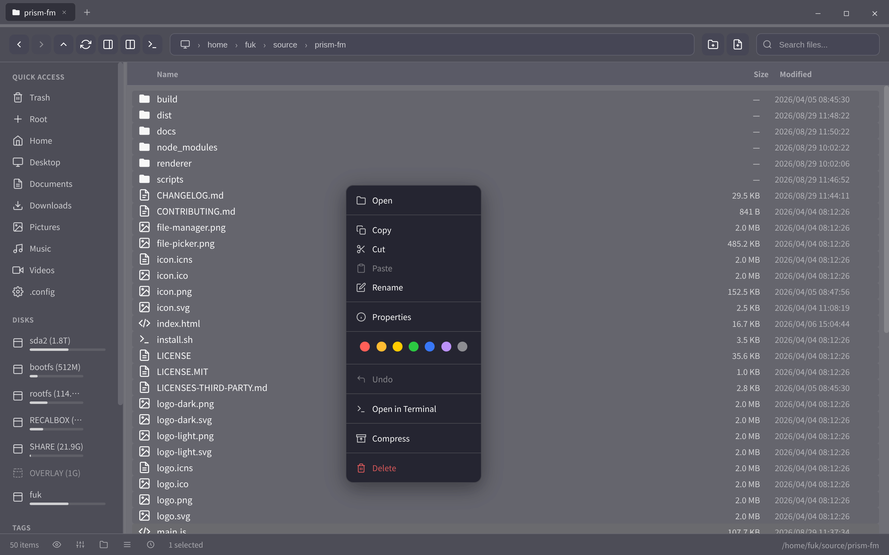
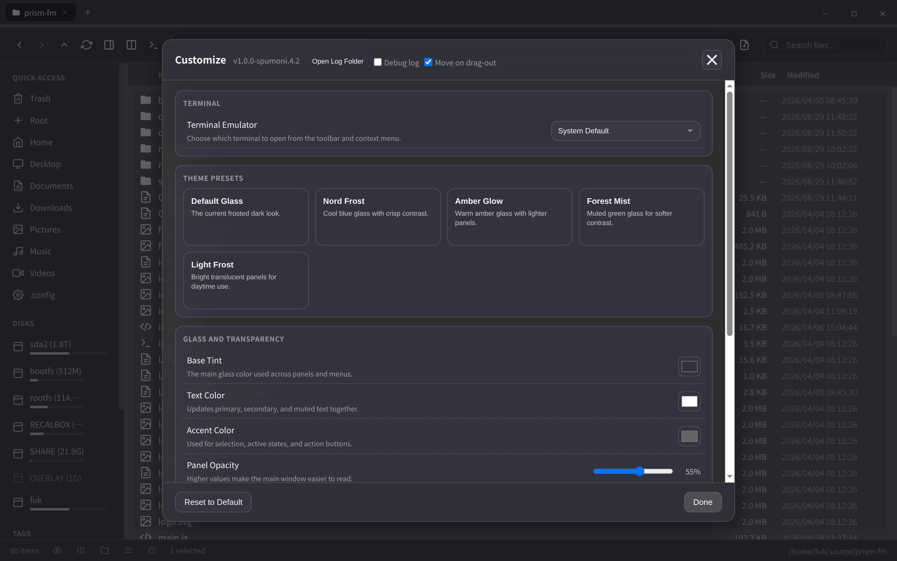

# Prism FM

A lightweight, transparent file manager for Linux, Windows, and macOS utilizing Electron.

[日本語版 README はこちら](README.ja.md)

> This project is a fork of [compiledkernel-idk/prism-fm](https://github.com/compiledkernel-idk/prism-fm). Based on our analysis of the commit history and codebase, prism-fm appears to have been forked from [TechyTechster/ez-fm](https://github.com/TechyTechster/ez-fm) and republished under a new name.
>
> We would like to express our sincere gratitude to both **TechyTechster**, the original creator of ez-fm, and **compiledkernel-idk**, who maintained and published prism-fm. The clean architecture and thoughtful design of the original project made it possible to extend it into a full cross-platform file manager. Thank you both for your contributions to the open-source community.



<table>
  <tr>
    <td width="50%"><br><sub>Preview pane with image metadata</sub></td>
    <td width="50%"><br><sub>Context menu with tags, undo, terminal and compress</sub></td>
  </tr>
  <tr>
    <td colspan="2"><br><sub>Customize: terminal, theme presets, glass/transparency, logging and drag-out options</sub></td>
  </tr>
</table>

## Recent Changes

See [CHANGELOG.md](CHANGELOG.md) for the full history.

### v1.0.0-spumoni.4.2

- Drag & drop rebuilt on the native OS drag on every platform: files reach other apps as real files (Wayland included), and in-app drops of the same drag work again
- Move on drag-out: after a plain drag to another app, the copy the target made is verified (size + SHA-256) and the original goes to the trash; Ctrl/Option-drag copies; toggle in Customize
- Fixed: crash on launch under Wayland (since 3.5), `npm start` sandbox abort on Ubuntu 24.04+, context submenu (New ▸) never appearing (since 3.6)
- Electron 28 → 44
- File logging with rotation (`~/.config/prism-fm/logs/prism-fm.log`), Debug log toggle and Open Log Folder in Customize; file operations, drag & drop, navigation and errors are recorded

### v1.0.0-spumoni.4.1

- Split view: Back/Forward rendered the previous directory; stale async responses no longer overwrite panes, tabs, preview or drive list
- Conflict "Replace" now fully replaces (no directory merge, symlink at destination not followed); cross-device move fallback only on EXDEV; same-device moves skip the disk space check
- Selection stays in sync after refresh; post-operation refresh targets the affected panes; Extract Here uses the folder it was queued from
- Directory copy continues past unreadable files; cancelled stream copy removes the partial file; conflict dialog can no longer hang an operation
- Archive fixes: no extraction into existing folders, no appending to existing archives, large archives no longer killed by output buffer limit
- macOS: Option is the copy modifier on drag; Cmd+Q honours the "operation in progress" confirmation
- Linux: context menu no longer built twice per right-click
- Cut clipboard survives a cancelled paste; Escape closes menus; confirm dialogs work with Enter/Escape

### v1.0.0-spumoni.4.0

- Operations panel: cancel running/queued copy, move and delete; pause/resume queue; history
- Undo implemented (context menu and Ctrl+Z); undo now tracks the real destination after conflict resolution and never deletes pre-existing files
- Fixed: copy/move of a folder into itself via paste (unbounded recursion), rename silently overwriting existing files, shell injection in sudo delete
- Fixed: shortcuts firing behind modals and on key auto-repeat, Ctrl+A selecting hidden files
- Fixed: sidebar/preview pane resize, external folder drop onto sidebar, inline image preview

### v1.0.0-spumoni.3.8

- File operation reliability: per-item error skip, symlink copy, move verification, disk space check
- Stream copy for large files (100MB+) with smooth progress, parallel copy for small files (6x)
- Batch delete with progress bar and cancel support
- Permission and timestamp preservation on copy
- Version display in Customize dialog
- Quit confirmation when file operations are in progress

### v1.0.0-spumoni.3.7

- PDF and video thumbnails (macOS: qlmanage, Linux: pdftoppm/ffmpeg)
- PDF and video preview in Preview Pane
- File conflict dialog on copy/move (Replace, Skip, Keep Both, Apply to all)
- Preview Pane toggle button in toolbar
- Hidden files displayed with reduced opacity
- Linux drag-out fix, date column width fix
- Reset All Folder Settings option in Settings menu

### v1.0.0-spumoni.3.5

- Terminal settings in Customize modal (11 presets including pwsh, Windows Terminal, kitty, etc.)
- Terminal toolbar button and "Open in Terminal" in all context menus
- Title bar double-click to maximize, window size/position persistence
- Compact row heights, Split View moved to toolbar, themed dropdown styling

### v1.0.0-spumoni.3.4

- File size column right-aligned with thousands separator
- Responsive layout reworked: 800px file name truncation, 650px hide dates, 480px sidebar overlay
- Column resizers removed (fixed widths)
- Drive list auto-refresh (5s polling), Eject replaces Unmount in context menu
- Compact row heights for Detailed/List views
- 7za path fix for packaged Linux builds

### v1.0.0-spumoni.3.3

- macOS transparency fix, process exit fix
- Four view modes: Detailed, List, Grid, Thumbnail (with image preview)
- Global default view mode setting, compact row heights

### v1.0.0-spumoni.3.2

- Windows Recycle Bin browsing via native `$I` file parsing (no PowerShell)
- Bundled 7za for cross-platform archive operations
- Japanese font support, date sort improvements, installer process termination

### v1.0.0-spumoni.3.1

- Windows window controls, hidden file detection, native drag-and-drop
- 14 new file type icons, theme opacity adjustments, performance optimizations
- Separate pack/installer build scripts for code signing

### v1.0.0-spumoni.3

- Custom window controls for Windows and Linux

### v1.0.0-spumoni.2

- Tab bar overlap fix for macOS

### v1.0.0-spumoni.1

- Context menu fix, performance improvements, application icon, cross-platform builds

## Features

- **Transparent UI**: Designed for seamless integration with modern compositors (Hyprland, Sway, etc.) and desktop environments.
- **Dual Pane Navigation**: Efficient file management with side-by-side views.
- **Core Operations**: Copy, move, delete, rename, and archive management (extract/compress only; browsing inside archives is not supported).
- **Drag and Drop**: Drag files out to external apps (native drag). Drop files from external apps or drag within Prism FM to move (hold Ctrl to copy; Option on macOS). Drag and drop into/from archives is not supported. Dragging files *out* to other apps always offers "copy" (Electron limitation, electron/electron#7207); with **Move on drag-out** enabled (Customize dialog, default on) Prism FM verifies the copy the target made and moves the original to the trash. Hold Ctrl (Option on macOS) while dragging to copy.
- **Preview System**: Integrated image, PDF, video, and text previews with thumbnail generation.
- **Tagging**: Essential file organization with color-coded tags.
- **Properties**: File/folder properties dialog with OS-specific info (Windows attributes, POSIX permissions), click-to-copy for name and path.
- **Terminal Integration**: Configurable terminal emulator with 11 presets; open from toolbar or context menu.
- **Theme Customizer**: Built-in theme editor with presets (Default Glass, Nord Frost, Amber Glow, Forest Mist, Light Frost) and Wal theme import.
- **XDG Integration**: Functions as a system-wide directory picker (Linux).

## Installation

```bash
git clone https://github.com/fukuyori/prism-fm.git
cd prism-fm
npm install
```

### Build

**One-step build (pack + installer):**

```bash
npm run build          # Current platform (auto-detect)
npm run build:win      # Windows (NSIS installer)
npm run build:mac      # macOS (DMG)
npm run build:linux    # Linux (AppImage + deb)
```

**Linux .deb with checks** (`scripts/build-linux.sh`): verifies the toolchain, installs missing dependencies and the Electron binary, builds, validates the package with `dpkg-deb`, and optionally smoke-tests the unpacked build:

```bash
npm run build:linux:deb                       # -> dist/prism-fm-<version>-amd64.deb
scripts/build-linux.sh --clean --smoke        # wipe dist/ first, launch the build for 6s afterwards
scripts/build-linux.sh --appimage             # also produce the AppImage
scripts/build-linux.sh --install              # sudo apt install the result
```

**Two-step build (for code signing):**

```bash
# Step 1: Pack executable only
npm run build:win:pack      # -> dist/win-unpacked/prism-fm.exe
npm run build:mac:pack      # -> dist/mac/prism-fm.app (or dist/mac-arm64/)
npm run build:linux:pack    # -> dist/linux-unpacked/prism-fm

# Step 2: Sign the binary (platform-specific)
# Windows:  signtool sign /f cert.pfx dist/win-unpacked/prism-fm.exe
# macOS:    codesign --deep --force --sign "Developer ID" dist/mac/prism-fm.app

# Step 3: Create installer from signed binary
npm run build:win:installer      # -> dist/prism-fm-<version>-x64.exe
npm run build:mac:installer      # -> dist/prism-fm-<version>.dmg
npm run build:linux:installer    # -> dist/prism-fm-<version>.AppImage + .deb
```

### Dependencies

**Arch Linux:**

```bash
sudo pacman -S nodejs npm electron
```

**Debian / Ubuntu:**

```bash
sudo apt install nodejs npm
sudo npm install -g electron
```

**Fedora:**

```bash
sudo dnf install nodejs npm
sudo npm install -g electron
```

## Usage

Launch via terminal or application menu:

```bash
prism-fm [path]
```

### Key Bindings

| Key | Action |
| :--- | :--- |
| `Ctrl+C` / `Ctrl+V` | Copy / Paste |
| `Ctrl+X` | Cut |
| `F2` | Rename |
| `Del` / `Shift+Del` | Trash / Permanent Delete |
| `Ctrl+T` / `Ctrl+W` | New Tab / Close Tab |
| `Ctrl+L` | Focus Path |
| `Ctrl+H` | Toggle Hidden Files |
| `F12` / `Ctrl+Shift+I` | Developer Tools |

## Configuration

Configuration is stored in `~/.config/prism-fm/` (Linux/macOS) or `%APPDATA%\prism-fm\` (Windows).

**Compositor Configuration (Hyprland):**

```ini
layerrule = blur,class:prism-fm
windowrulev2 = opacity 0.9 0.8,class:^(prism-fm)$
```

## Reporting problems / logs

Prism FM writes a log file:

| OS | Path |
|---|---|
| Linux | `~/.config/prism-fm/logs/prism-fm.log` |
| Windows | `%APPDATA%\prism-fm\logs\prism-fm.log` |
| macOS | `~/Library/Logs/prism-fm/prism-fm.log` |

Open **Customize** (toolbar) → **Open Log Folder**. For a detailed trace, enable **Debug log** there (or start with `PRISM_LOG=debug`), reproduce the problem, then attach `prism-fm.log` to the issue.

## License

This fork is licensed under [GPL-3.0](LICENSE).

The original ez-fm by TechyTechster / prism-fm by compiledkernel-idk is licensed under MIT. This fork includes the bundled [7za binary](https://www.7-zip.org/) (LGPL-2.1) for archive operations.

See [LICENSES-THIRD-PARTY.md](LICENSES-THIRD-PARTY.md) for full third-party license details.
